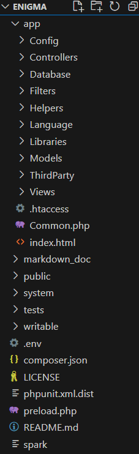

# Space Invaders en python

### Exemple : 


###### Musique secrète quand la touche k est presser


### Acquis :

- **Architecture MVC**

    - 
    ```php
    public function lister()
    {
        $data['titre'] = "Liste de tous les comptes";
        $data['logins'] = $this->model->get_all_compte();
        $data['nbcompte'] = $this->model->get_nb_compte();
        $session = session();
        if ($session->has('user')) {
            if ($session->get('role') == 'A') {
                return view('templates/haut', $data)
                    . view('templates/menu_administrateur')
                    . view('affichage_comptes')
                    . view('templates/bas');
            } else{
                return redirect()->to('/compte/afficher_profil');
            }
        } else {
            return redirect()->to('/compte/connecter');
        }
    }

    ```

- **Framework CodeIgniter 4**
    ```php
    public function creer()
    {
        $session = session();
        // L’utilisateur a validé le formulaire en cliquant sur le bouton
        if ($this->request->getMethod() == "post") {
            if (
                !$this->validate(
                    [
                        'pseudo' => 'required|max_length[255]|min_length[2]|is_unique[t_compte_com.com_pseudo]',
                        'mdp' => 'required|max_length[255]|min_length[8]',
                        'role' => 'in_list[A,O]',
                        'vali' => 'in_list[A,D]'
                    ],
                    [
                        // Configuration des messages d’erreurs
                        'pseudo' => [
                            'required' => 'Veuillez entrer un pseudo pour le compte !',
                            'is_unique' => 'Pseudo déja existant',
                        ],
                        'mdp' => [
                            'min_length' => 'Le mot de passe saisi est trop court !',
                            'required' => 'Veuillez entrer un mot de passe !',
                        ],
                        'role' => [
                            'in_list' => 'Le rôle doit être soit "A" ou "O".'
                        ],
                        'vali' => [
                            'in_list' => 'Le validité doit être soit "A" ou "D".'
                        ]
                    ]
                )
            ) {
                // La validation du formulaire a échoué, retour au formulaire !
                return view('templates/haut')
                    . view( 'templates/menu_administrateur')
                    . view('compte/compte_creer')
                    . view('templates/bas');
            }
            // La validation du formulaire a réussi, traitement du formulaire
            $recuperation = $this->validator->getValidated();
            $this->model->set_compte($recuperation);
            $data['le_compte'] = $recuperation['pseudo'];
            $data['le_message'] = "Nouveau nombre de comptes : ";
            //Appel de la fonction créée dans le précédent tutoriel :
            $data['le_total'] = $this->model->get_nb_compte();
            return redirect()->to('/compte/lister');
        }
        if ($session->has('user')) {
            if($session->get('role')=='A'){
                return view('templates/haut')
                . view('templates/menu_administrateur')
                . view('compte/compte_creer')
                . view('templates/bas');
            }else{
                return redirect()->to('/compte/afficher_profil');
            }
        } else {
            return redirect()->to('/compte/connecter');
        }

    }

    ```
